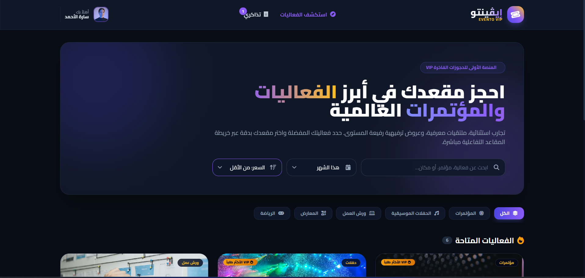

# 🎟️ EVENTO VIP — Handcrafted Luxury Event & Ticket Booking Platform

A modern, highly interactive, and responsive luxury event booking web application built purely with front-end technologies. Designed with a sleek dark-glass luxury aesthetic (`#0F0F12`, Gold `#D4AF37`, & Royal Violet) to provide an exclusive booking experience for high-end concerts, conferences, and cultural events.

---

## 📸 Preview

---

## ✨ Key Features

- **Luxury Aesthetic & Dark Glassmorphism:** Styled with rich dark backgrounds, glowing gold accents, and dynamic glass effects (`backdrop-blur`).
- **Interactive Seat Map:** Real-time visual seating map divided into interactive tiers (VIP, Gold, Standard) with live price updates and seat reservation state.
- **Dynamic Event Catalog:** Browse, search, and filter events in real-time by category (Concerts, Conferences, Theater, Sports) and date.
- **Multi-step Booking Workflow:** Smooth step-by-step checkout modal (Seat Selection ➔ Customer Details ➔ Payment Method).
- **Interactive Ticket & QR Code Generation:** Instant generation of a personalized VIP ticket with a functional Mock QR code, print options, and dynamic download.
- **Persistent Bookings ("My Tickets"):** Integrated `LocalStorage` support allowing users to manage, view, and print their saved tickets anytime.
- **100% Responsive & Touch-Optimized:** Perfectly tuned across mobile, tablet, and desktop viewports with pan-and-scroll touch optimization for the seat map.

---

## 🛠️ Tech Stack

- **HTML5:** Semantic RTL markup structure optimized for Arabic language support.
- **CSS3 / Tailwind CSS:** Custom utility classes, responsive grid systems, smooth micro-interactions, and glassmorphism styling.
- **JavaScript (ES6+):** Vanilla JS for reactive state management, modal handling, local storage persistence, and cart/seat calculations.
- **External Libraries & Fonts:**
  - **Google Fonts:** `Cairo` for high-end modern Arabic typography.
  - **FontAwesome 6.5:** Rich icon set for UI micro-interactions.
  - **QRCode.js:** Client-side dynamic QR code rendering.
  - **Canvas Confetti:** Celebration animations upon booking success.

---

## 🔗 Live Demo

👉 [Click Here to View Live Demo](https://ahlam107a-ux.github.io/Evento-VIP/)

